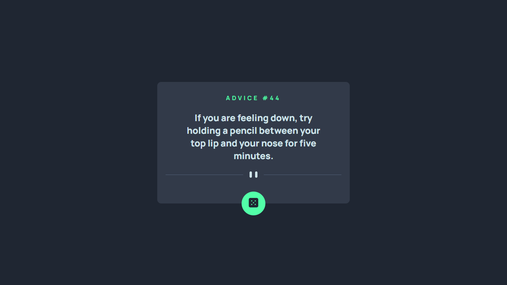
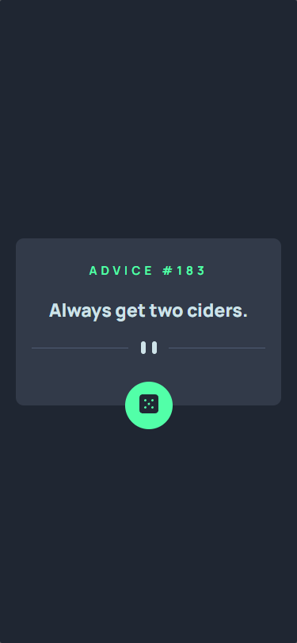

<div align="center">
  
</div>
<h1 align="center">
  Gerador de Conselhos
</h1>
<p align="center">
    <a href="https://jonathanbenedito.github.io/advice-generator-app/" target="_blank">Gerador de Conselhos</a> é um web app que gera um conselho aleatório após clicar no botão. Desenvolvido para um desafio do <a href="https://www.frontendmentor.io/challenges/advice-generator-app-QdUG-13db">Frontend Mentor</a> e como um exercício no curso <a href="https://www.linkedin.com/school/devquest-dev-em-dobro/">DevQuest - Dev em Dobro</a>.
</p>




## 🛠 Guia de instalação

1. Faça o clone do projeto
    ```
    git clone https://github.com/jonathanBenedito/advice-generator-app.git
    ```

2. Acesse o repositório
    ```
    cd advice-generator-app
    ```

## 💬 Sobre o projeto

### O desafio

A proposta é construir um web app usando <a href="https://api.adviceslip.com/">Advice Slip API</a> utilizando o design fornecido pelo desafio.

O layout deve ser responsivo para diferentes tamanhos de tela e o usuário deve ser capaz gerar um novo conselho ao clicar no botão de dado.

### Fotos (Mobile)

|   | 
|:---:|
| Smartphone layout |

### Links

Website: <a href="https://jonathanbenedito.github.io/advice-generator-app/">jonathanbenedito.github.io/advice-generator-app</a>
<br />
Desafio do Frontend Mentor: <a href="https://www.frontendmentor.io/challenges/advice-generator-app-QdUG-13db">frontendmentor.io/challenges/advice-generator-app-QdUG-13db</a> 
<br />
Advice Slip API: <a href="https://api.adviceslip.com/">api.adviceslip.com</a>
<br />
DevQuest - Dev em Dobro (Linkedin): <a href="https://www.linkedin.com/school/devquest-dev-em-dobro/" target="_blank">linkedin.com/school/devquest-dev-em-dobro/</a>

### Tecnologias

O website foi construído usando HTML 5, CSS 3 e Javascript.

<div style="display: flex; margin-top: 15px; gap: 20px;">
  
  
       
</div>
